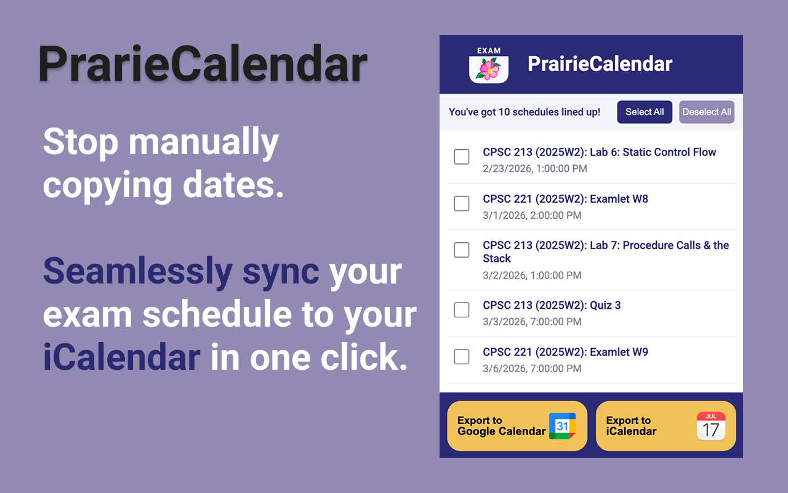
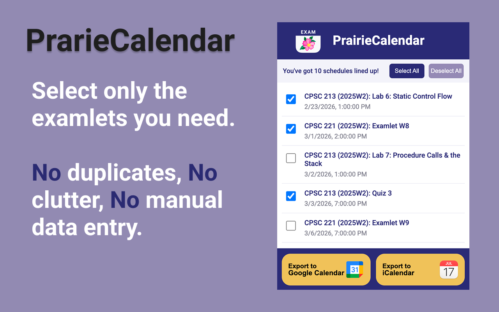
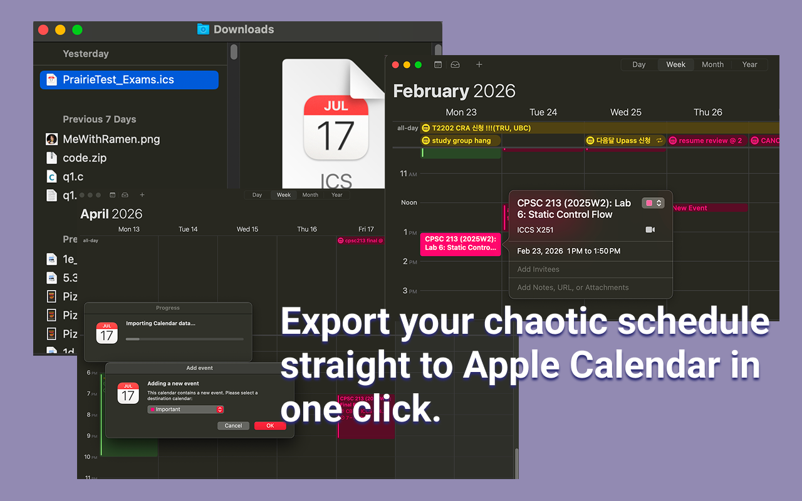
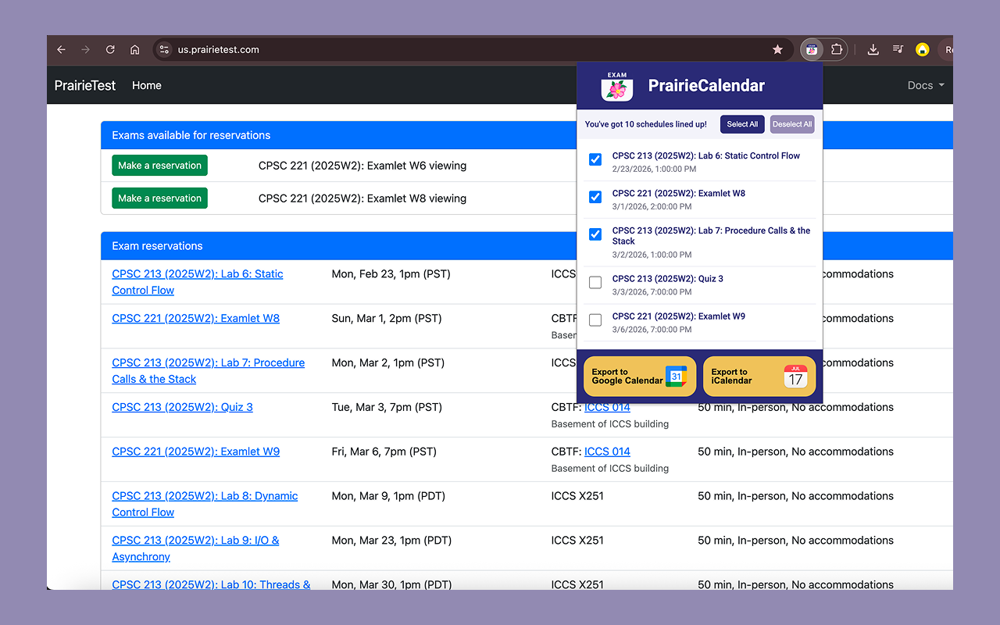

# PrairieCalendar

  

  

*A Chrome extension that extracts PrairieTest schedules and allows users to export them to their calendar with ease! No more manual labor to copy the schedule. Built with 🫐 by Team BlueberryPie (Jena & Jade).*

## Why We Built This

Let's set the scene: You are navigating the chaotic life of a CS student at UBC. You are constantly checking the PrairieTest webpage to book your quizzes, examlets, and final exams. You manually copy the dates into your calendar, aggressively double-checking the location and time because—let's face it—one typo means you might sleep through a midterm.💀 Panic ensues. 😞

We stared at the PrairieTest interface and asked the golden question: *Why is there no "Export to Calendar" button?* We were tired of the manual data entry and the underlying anxiety of missing an exam. So, Jade and I decided to stop complaining and start coding. 

Enter **PrairieCalendar**: a lightweight tool designed to manage our chaotic (or endless!) exam schedules seamlessly.

  

## What It Does

PrairieCalendar turns a wall of HTML text into a neatly formatted schedule.

- **Smart Extraction:** Parses all schedule data directly from the PrairieTest webpage.
- **Sleek UI:** Displays the full list of reservations in a clean popup, complete with custom Figma-designed icons and our signature "Deep Blueberry" and "Pie Crust" team color palette. (Because, why not?)
- **Selective Exporting:** You’ve already downloaded some schedules before? We allow users to select specific events via a clean checkbox UI!
- **Instant `.ics` Generation:** Converts your selected schedules into a valid iCalendar file so you can drag and drop it into Apple Calendar or Outlook.
- **Google Calendar Support (*Baking in the Oven!*):** We designed the UI for a direct Google Calendar export, but dealing with Google's API authentication takes more caffeine than we currently have. It is our official "Coming Soon" feature! For now, the button sits there looking pretty, waiting for v2.0.

  

## Built With

- **Vanilla JavaScript**
- **Chrome Extension Manifest V3**
- **HTML, CSS**
- **Chrome storage.local API**
- **iCalendar (.ics) file format**
- **Figma (UI/UX Design)**
- **Git & GitHub**

## Under the Hood

This project was an exercise in shipping a clean Minimum Viable Product (MVP) using Vanilla JavaScript, without over-engineering.

- **Privacy First:** There is no database required. All processing is done locally inside the extension to protect student data.
- **The Architecture:** Our `content.js` script extracts the raw schedule data, `parser.js` standardizes the formatting, and `popup.js` renders the selectable list. Once the user selects their events, `ics.js` generates the file.
- **Data Scrubbing:** We built custom parsing logic to handle edge cases, like converting academic term codes (e.g., 2025W2) into accurate calendar years and using JS `Set` objects to strip out duplicate DOM text blobs.

## The Design: UI/UX Matters

We strongly believe that a utility tool shouldn't look like a 1990s spreadsheet. To ensure a sleek, intuitive user experience, the entire interface was meticulously prototyped in **Figma** before a single line of CSS was written.

Because our team name is **BlueberryPie**, we decided to bake that identity directly into our design system. Our custom UI features a crisp "Deep Blueberry" primary color for sharp, professional branding, perfectly accented by a warm "Pie Crust" gold to make our Call-to-Action buttons pop. It is clean, modern, and exceptionally easy on the eyes during those late-night, caffeine-fueled study sessions. 

## The Impact: Thinking Bigger

What started as a desperate attempt to organize our own UBC schedules quickly revealed a much larger opportunity. PrairieTest.com isn't just a local testing facility; it's an assessment platform heavily utilized by multiple institutions across North America.

The pain point of manual exam tracking isn't an isolated incident—it is a universal headache for thousands of students every single semester. By building PrairieCalendar, we aren't just solving a localized inconvenience. We have engineered a highly scalable extension that can instantly streamline the academic workflows of university students continent-wide.

## Get the Extension!

**For the Students (The Easy Way):**
We are officially shipping this! You can grab it directly from the Chrome Web Store:

👉 to be continued

Just click "Add to Chrome," and pin the extension. 

**For the Devs (The Fun Way):**
Want to peek under the hood or contribute? You can run it locally:

1. Clone this repository.
2. Open Chrome and navigate to `chrome://extensions`.
3. Enable "Developer Mode" in the top right corner.
4. Click "Load unpacked" and select this project folder.
5. Reload after making any changes. 
6. You are all set! ◡̈

## Permissions

PrairieCalendar only requests the minimum permissions necessary to function:

- **storage** — Used to store parsed reservation data locally on the user's device
- **host permissions (PrairieTest domain)** — Allows the extension to extract reservation data from PrairieTest pages

PrairieCalendar does not access or modify data on any other websites.

## Contact

For questions, bug reports, or feature requests, feel free to reach out:

📧 team-blueberrypie@googlegroups.com

  

