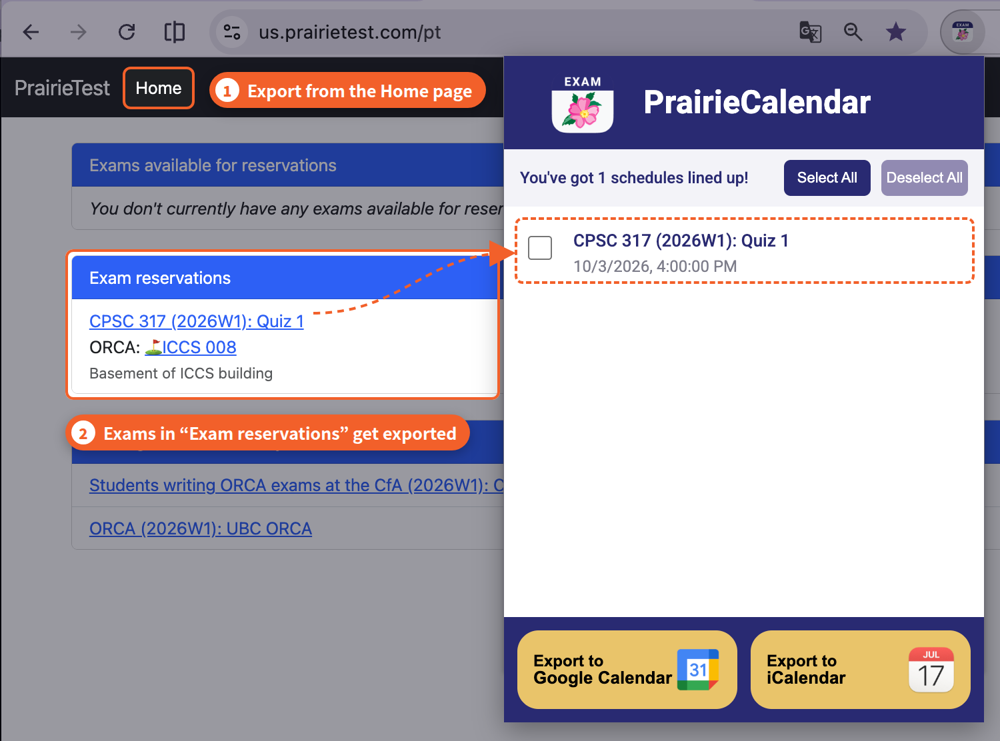
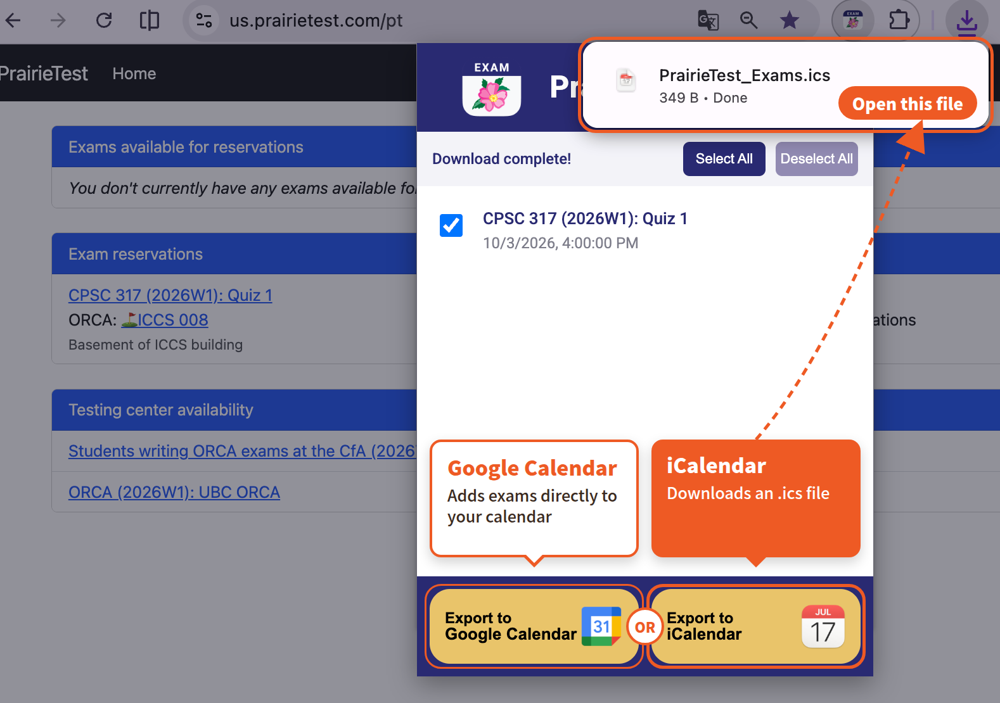
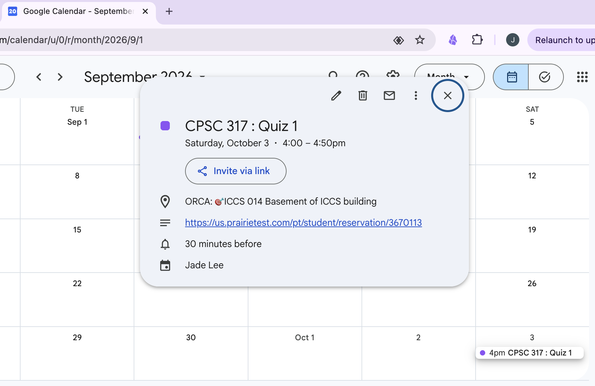
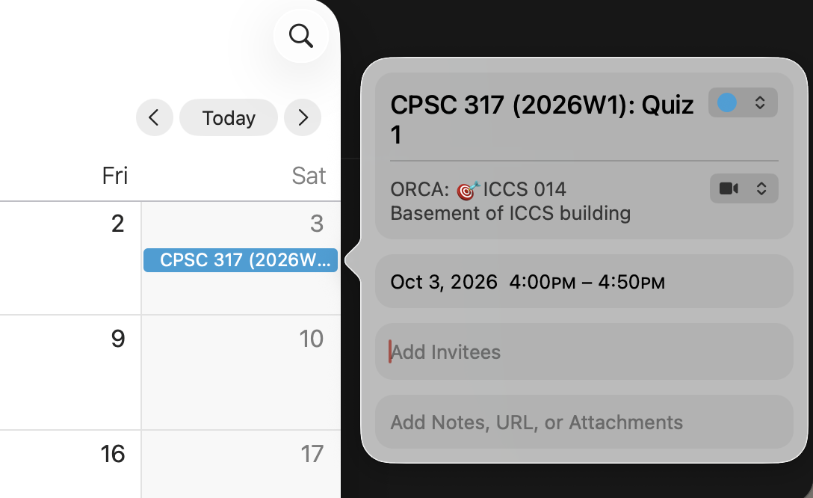
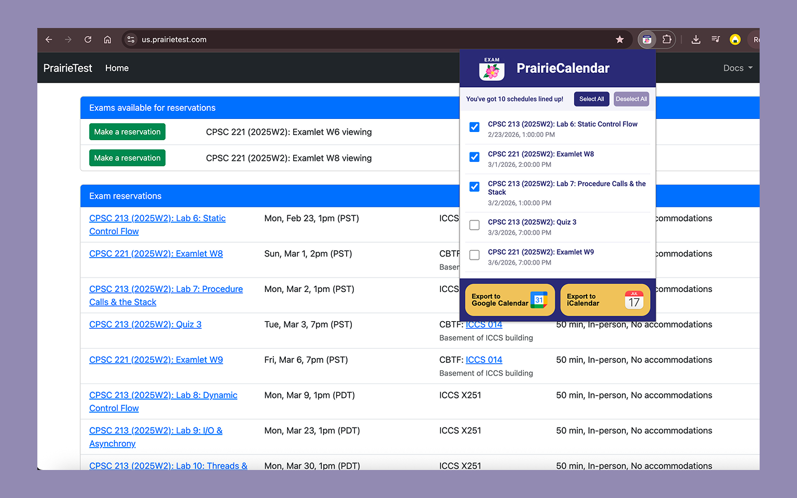
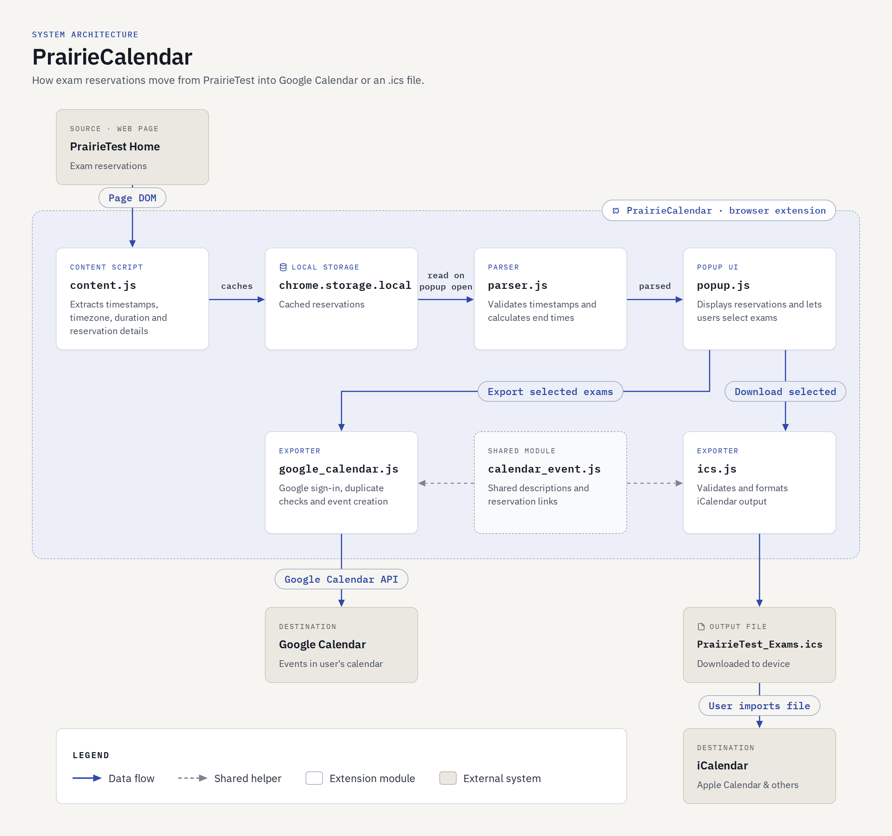
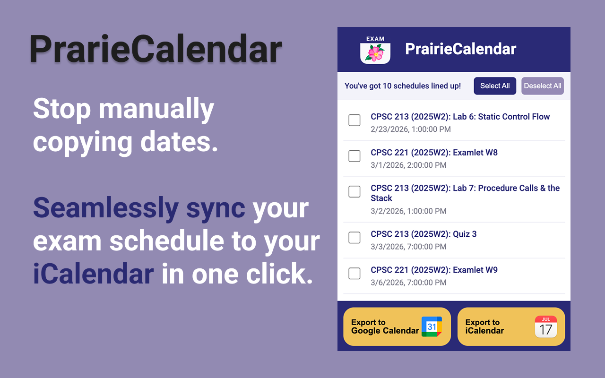
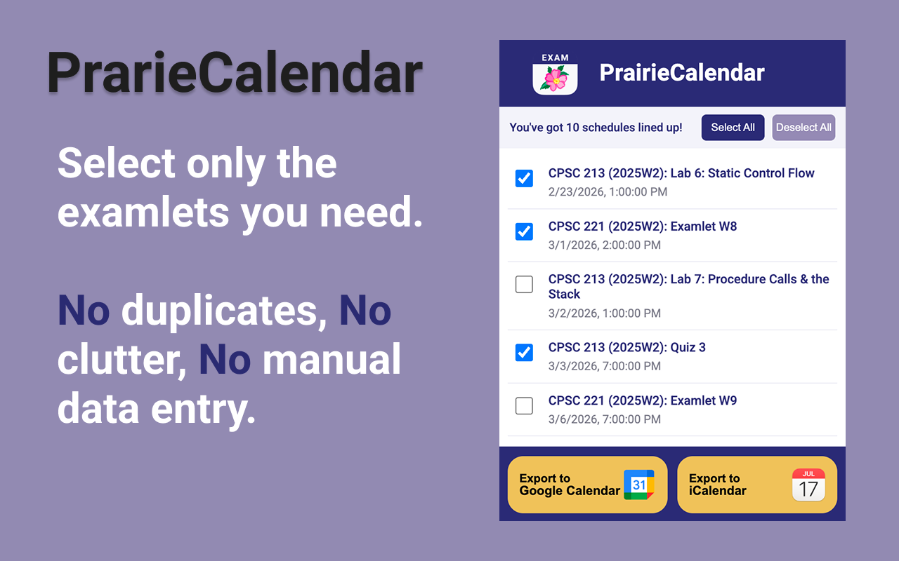

# PrairieCalendar

Export your booked PrairieTest exams to **Google Calendar** or an **`.ics` file for Apple Calendar**—without copying dates by hand.

🚀 **[Install PrairieCalendar from the Chrome Web Store (Click!)](https://chromewebstore.google.com/detail/PrairieCalendar/jfgdhmfkgejkgliebffeohcddbohldfk)**

🌐 **Tested browsers:** Google Chrome, Brave, Arc, and Microsoft Edge.

🫐 Built by **Team BlueberryPie (Jena & Jade)**.

 

## Table of Contents

- [How to Use](#how-to-use)
- [Important Notes](#important-notes)
- [Troubleshooting](#troubleshooting)
- [What It Does](#what-it-does)
- [Why We Built This](#why-we-built-this)
- [The Impact](#the-impact)
- [Built With](#built-with)
- [Under the Hood](#under-the-hood)
- [The Design: UI/UX Matters](#the-design-uiux-matters)
- [For Developers](#for-developers)
- [Permissions](#permissions)
- [Contact](#contact)

 

## How to Use

> **Where to open the extension:** Finish booking your exam on PrairieTest, then click **Home** in the top navigation. Open PrairieCalendar when your booked exam appears under **Exam reservations**, as shown in the screenshot below.

  

### 1. Install and pin the extension

Install PrairieCalendar using the Chrome Web Store link above, then pin it to your browser's toolbar for easy access.

### 2. Complete your reservation and return to Home

1. Sign in to PrairieTest and finish booking your exam date and time.
2. Click **Home** in the top navigation.
3. Check that your booked exam appears under **Exam reservations**, as shown in the Home screenshot above.

### 3. Open PrairieCalendar and select your exams

With your booked exam visible under **Exam reservations** on **Home**, click the PrairieCalendar icon. Select the exams you want to export using the checkboxes, or use **Select All**.

### 4. Choose your calendar

- **Export to Google Calendar:** Follow the Google sign-in and permission prompts if shown, then complete the export to add your selected exams directly to Google Calendar.
- **Export to iCalendar:** Click this button to download an `.ics` file. Open the downloaded file to add the selected exams to Apple Calendar.

  

Here is the same reservation once it lands, either way:

| Exported to Google Calendar | Exported as an `.ics` file |
| :---: | :---: |
|  |  |

After exporting, check the exam date, time, duration, and location in your calendar against the reservation on PrairieTest.

 

## Important Notes

- **PrairieCalendar exports existing bookings.** It does not book, change, or cancel exams on PrairieTest.
- **Use Home with confirmed reservations.** The booking screen and individual reservation-details page are not the pages to export from.
- **Changed or cancelled a reservation?** Check the corresponding event in your calendar and update or remove it if needed. Do not assume an earlier export still matches your current reservation.
- **PrairieTest is your reference for exam details.** Always confirm your latest reservation details and exam instructions there.

 

## Troubleshooting

Most messages in the popup say what to do. These four do not.

| Message | What it means |
| --- | --- |
| `No raw reservations found.` | PrairieCalendar reads the **Home** page. Sign in to PrairieTest, open Home, and check that your exam is listed under **Exam reservations** — then reopen the popup. |
| `Check the exam time` under a reservation | The exam's length could not be read, so the end time is a one-hour guess. The start time is still correct. Check the length on PrairieTest and fix the event after exporting. |
| `Google export failed: ...` | Finish the Google sign-in and permission prompts, then export again. If it keeps failing, send us the message. |
| `Download complete!`, but Apple Calendar has nothing new | The file is downloaded, not imported. Open **`PrairieTest_Exams.ics`** or drag it into Apple Calendar. |

 

## What It Does

PrairieCalendar turns a wall of HTML text into a neatly formatted schedule.

- **Smart Extraction:** Parses all schedule data directly from the PrairieTest webpage.
- **Selective Exporting:** Only want your finals in the calendar? Pick the exams you want via a clean checkbox UI, or take them all with **Select All**.
- **Instant `.ics` Generation:** Converts your selected schedules into an iCalendar file you can drag and drop into Apple Calendar.
- **Google Calendar Support:** Export your selected schedules directly to Google Calendar with one click, added for you through the Google Calendar API.
- **No Duplicate Events:** Export the same exam twice and you still end up with one event.
- **Correct Times, Any Timezone:** Dynamically extracts absolute UTC timestamps directly from the PrairieTest DOM, so the extension isn't tied to one university's academic term structure or timezone.
- **Sleek Yet Cute UI:** Displays the full list of reservations in a clean popup, complete with custom Figma-designed icons and our signature "Deep Blueberry" and "Pie Crust" team color palette. (Because, why not?)

  

 

## Why We Built This

Let's set the scene: You are navigating the chaotic life of a CS student at UBC. You are constantly checking the PrairieTest webpage to book your quizzes, examlets, and final exams. You manually copy the dates into your calendar, aggressively double-checking the location and time because—let's face it—one typo means you might sleep through a midterm.💀 Panic ensues. 😞

We stared at the PrairieTest interface and asked the golden question: *Why is there no "Export to Calendar" button?* We were tired of the manual data entry and the underlying anxiety of missing an exam. So, we decided to stop complaining and start coding.

We present to you the **PrairieCalendar**: a lightweight tool designed to manage our chaotic (or endless!) exam schedules seamlessly.

 

## The Impact

What started as a fix for our own UBC schedules turned out to have a wider reach. PrairieTest isn't a UBC system — it's an assessment platform used by institutions across North America, and their students copy exam times by hand exactly like we did.

So we built for that from the start, with nothing in the extension tied to our own campus. We've tested it at UBC so far, and we hope it spreads to every campus on the platform.

 

## Built With

- **Vanilla JavaScript**
- **Chrome Extension Manifest V3**
- **HTML, CSS**
- **Google Calendar API**
- **Google OAuth 2.0**
- **iCalendar (.ics) file format**
- **Figma (UI/UX Design)**
- **Git & GitHub**

 

## Under the Hood

This project was an exercise in shipping a clean Minimum Viable Product (MVP) using Vanilla JavaScript, without over-engineering.

**From reservation to calendar event**

1. `content.js` reads the PrairieTest page and pulls out each reservation — the exact timestamp, the exam's timezone, how long it runs, the title and location — then saves them with `chrome.storage.local`.
2. `parser.js` checks those timestamps and works out each exam's end time.
3. `popup.js` renders the list you pick from.
4. `ics.js` writes the calendar file, or `google_calendar.js` signs you in and talks to the Calendar API. Both go through `calendar_event.js`, so an exam is described the same way either way.

**What we cared about**

- **Privacy First:** There is no database required. All processing is done locally inside the extension to protect student data.
- **Reading Data, Not Text:** PrairieTest publishes each exam's exact instant and timezone in the page, alongside the time it shows on screen. We read those values instead of re-parsing the screen, which is what keeps an exam at the right time whatever timezone the browser is set to.
- **Tested Where It Matters:** 18 automated tests cover the timestamp parsing, the iCalendar output and the Google export path, and the suite runs under several timezone settings.

 

## The Design: UI/UX Matters

  

  

We strongly believe that a utility tool shouldn't look like a 1990s spreadsheet. To ensure a sleek, intuitive user experience, the entire interface was meticulously prototyped in **Figma** before a single line of CSS was written.

Because our team name is **BlueberryPie**, we decided to bake that identity directly into our design system. Our custom UI features a crisp "Deep Blueberry" primary color for sharp, professional branding, perfectly accented by a warm "Pie Crust" gold to make our Call-to-Action buttons pop. It is clean, modern, and exceptionally easy on the eyes during those late-night, caffeine-fueled study sessions.

 

## For Developers

Want to peek under the hood or contribute? You can run it locally:

1. Clone this repository.
2. Open Chrome and navigate to `chrome://extensions`.
3. Enable "Developer Mode" in the top right corner.
4. Click "Load unpacked" and select this project folder.
5. Reload after making any changes.
6. You are all set! ◡̈

 

## Permissions

PrairieCalendar only requests the minimum permissions necessary to function:

- **storage** — Used to store parsed reservation data locally on the user's device
- **identity** — Used to authenticate with Google for Google Calendar export
- **host permissions (PrairieTest domain)** — Allows the extension to extract reservation data from PrairieTest pages
- **host permissions (Google APIs)** — Required to communicate with the Google Calendar API

PrairieCalendar does not access or modify data on any other websites.

 

## Contact

For questions, bug reports, or feature requests, feel free to reach out:

📧 team.blueberrypie@gmail.com

  

